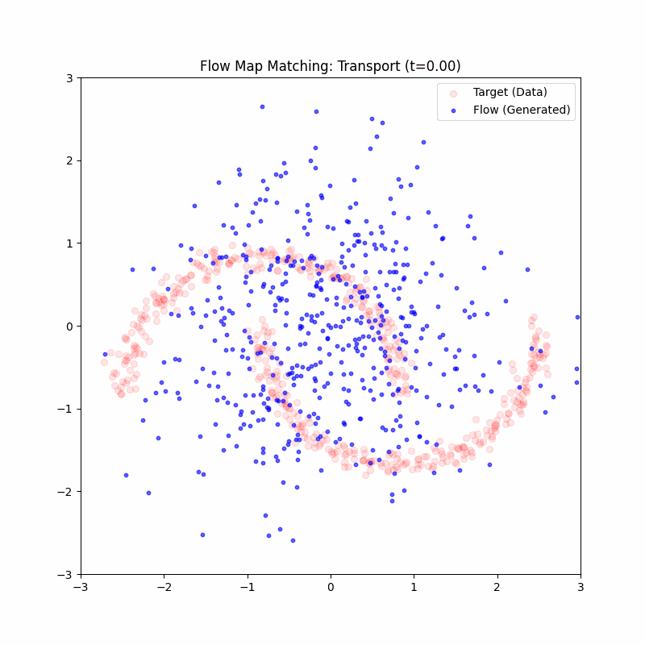

<p align="center">
  <h1 align="center">🌊 Flow Matching & Stochastic Interpolants</h1>
  <p align="center">
    <em>From Conditional Flow Matching to Lagrangian Map Distillation — a unified implementation</em>
  </p>
  <p align="center">
    
    
    
  </p>
</p>

---

## 📄 Technical Report

A detailed mathematical report (written in LaTeX) is available in [`reports/flow_matching_sde_report.pdf`](reports/flow_matching_sde_report.pdf). It covers the theoretical foundations of the project: stochastic differential equations, conditional flow matching, interpolant design, and the Lagrangian map distillation loss derivation.

> [!NOTE]
> The report is the best entry point if you are looking for formal mathematical details, proofs, and references to the literature.

---

## 🎞️ Visual Summary

### Linear Interpolant — Rectified Flow

The flow map learns to transport Gaussian noise $x_0 \sim \mathcal{N}(0, I)$ to the target distribution (two-moons) in a **single forward pass**, distilled from a teacher that uses the linear interpolant $x_t = (1-t)\,x_0 + t\,x_1$.

<p align="center">
  
</p>

### Stochastic Interpolant — Brownian Bridge

Same architecture, but the teacher is trained with a **stochastic interpolant** based on a Brownian bridge: $x_t = (1-t)\,x_0 + t\,x_1 + \sigma\sqrt{t(1-t)}\,z$, which adds controlled stochasticity to the trajectory. The student then distills this richer dynamics.

<p align="center">
  
</p>

---

## 🧠 Project Overview

This project implements a **teacher–student framework** for generative transport on 2D data (two-moons benchmark):

| Stage | Model | Role |
|:---:|:---:|:---|
| **1** | `VelocityField` (Teacher) | Learns the instantaneous velocity field $v_\theta(x_t, t)$ via Conditional Flow Matching |
| **2** | `FlowMapNetwork` (Student) | Learns the full transport map $X_\varphi(x, s, t)$ via Lagrangian Map Distillation from the frozen teacher |

### Key ideas

- **Conditional Flow Matching (CFM)** — The teacher minimises $\mathbb{E}\bigl[\|v_\theta(x_t, t) - u_t\|^2\bigr]$ where $u_t$ is the analytical target velocity derived from the interpolant.
- **Interpolants** — Two choices are provided:
  - *Linear* (Rectified Flow): $\alpha_t = 1-t, \beta_t = t, \gamma_t = 0$
  - *Stochastic* (Brownian Bridge): $\alpha_t = 1-t, \beta_t = t, \gamma_t = \sigma\sqrt{t(1-t)}$
- **Lagrangian Map Distillation (LMD)** — The student satisfies a hard constraint $X_\varphi(x, s, s) = x$ by construction, and is trained so that $\partial_t X_\varphi \approx v_\theta$ along the flow.
- **Single-step generation** — Once trained, the student generates samples in one forward pass: $x_1 = X_\varphi(x_0, 0, 1)$.

---

## 📂 Repository Structure

```
flow_matching_sde/
├── reports/
│   └── flow_matching_sde_report.pdf   # LaTeX technical report
├── src/
│   ├── algorithms/
│   │   ├── interpolants.py            # Linear & Stochastic interpolants
│   │   └── losses.py                  # CFM loss + 3 variants of LMD loss
│   ├── neural_nets/
│   │   ├── models.py                  # VelocityField (teacher) & FlowMapNetwork (student)
│   │   ├── training.py                # Teacher training loop
│   │   └── training_fm.py            # Student (flow map) training loop
│   ├── utils/
│   │   └── maths.py                   # Verification: identity, semigroup, ODE consistency
│   └── visualization/
│       ├── plots.py                   # Velocity field & transport visualisation
│       ├── flow_animation.gif         # Animation — linear interpolant
│       └── flow_animation_stochastic.gif  # Animation — stochastic interpolant
├── notebooks/
│   ├── verifications.ipynb            # Mathematical property checks
│   └── vis_data.ipynb                 # Data exploration & visualisation
├── checkpoints/                       # Pre-trained model weights
│   ├── velocity_teacher_linear.pth
│   ├── velocity_teacher_stochastic.pth
│   ├── flow_map_student.pth
│   └── flow_map_student_stochastic_teacher.pth
├── figures/                           # Training snapshots (velocity fields, transport)
│   ├── velocity/
│   └── flow_map/
└── requirements.txt
```

---

## ⚙️ Installation

```bash
git clone https://github.com/<your-username>/flow_matching_sde.git
cd flow_matching_sde

python -m venv venv
source venv/bin/activate

pip install -r requirements.txt
```

---

## 🚀 Usage

### 1. Train the Teacher (Velocity Field)

```bash
python -m src.neural_nets.training
```

Configurable options in `src/neural_nets/training.py`:

| Parameter | Default | Description |
|---|---|---|
| `interpolant` | `"stochastic"` | `"linear"` or `"stochastic"` |
| `n_epochs` | 10 000 | Number of training epochs |
| `n_samples` | 4 096 | Batch size (two-moons samples) |
| `lr` | 2e-3 | Initial learning rate |

### 2. Train the Student (Flow Map)

```bash
python -m src.neural_nets.training_fm
```

The student loads the frozen teacher checkpoint and distills the velocity field into a one-step transport map.

### 3. Verify Mathematical Properties

Open [`notebooks/verifications.ipynb`](notebooks/verifications.ipynb) to check:

| Property | Formula | Expected |
|---|---|---|
| **Identity** | $X_\varphi(x, t, t) = x$ | MSE ≈ 0 (exact by construction) |
| **Semigroup** | $X_\varphi(x, s, t) \approx X_\varphi(X_\varphi(x, s, u), u, t)$ | MSE small |
| **ODE consistency** | Student $X_\varphi(x,0,1)$ ≈ Euler 100 steps of $v_\theta$ | MSE small |

---

## 🧮 Mathematical Foundations

### Conditional Flow Matching

Given a source distribution $p_0$ (Gaussian) and a target distribution $p_1$ (data), we define a path $x_t$ between paired samples $(x_0, x_1)$ via an interpolant:

$$x_t = \alpha_t\, x_0 + \beta_t\, x_1 + \gamma_t\, z, \quad z \sim \mathcal{N}(0, I)$$

The teacher network $v_\theta$ minimises:

$$\mathcal{L}_{\text{CFM}}(\theta) = \mathbb{E}_{t, x_0, x_1}\bigl[\|v_\theta(x_t, t) - u_t\|^2\bigr]$$

where $u_t = \dot{x}_t$ is the analytical target velocity.

### Lagrangian Map Distillation

The student $X_\varphi(x, s, t)$ approximates the flow map with a **hard constraint**:

$$X_\varphi(x, s, t) = x + (t - s)\,\bar{v}_\varphi(x, s, t)$$

ensuring $X_\varphi(x, s, s) = x$ exactly. The distillation loss is:

$$\mathcal{L}_{\text{LMD}}(\varphi) = \mathbb{E}_{x_s, s, t}\bigl[\|\partial_t X_\varphi(x_s, s, t) - v_\theta(X_\varphi(x_s, s, t), t)\|^2\bigr]$$

Three implementations of the time derivative $\partial_t X_\varphi$ are provided:
1. **Finite differences** — fast, approximate
2. **Autograd** — exact, memory-intensive
3. **Optimised** — exploits the architecture's hard constraint

---

## 📖 References

- Lipman, Y., Chen, R. T., Ben-Hamu, H., Nickel, M. (2023). *Flow Matching for Generative Modeling*. ICLR 2023.
- Albergo, M. S., Vanden-Eijnden, E. (2023). *Building Normalizing Flows with Stochastic Interpolants*. ICLR 2023.
- Liu, X., Gong, C., Liu, Q. (2023). *Flow Straight and Fast: Learning to Generate and Transfer Data with Rectified Flows*. ICLR 2023.
- Pooladian, A.-A., Ben-Hamu, H., Lipman, Y., Chen, R. T. Q. (2023). *Multisample Flow Matching: Straightening Flows with Minibatch Couplings*.

---

<p align="center">
  <em>This project is intended for research and educational purposes only.</em>
</p>
