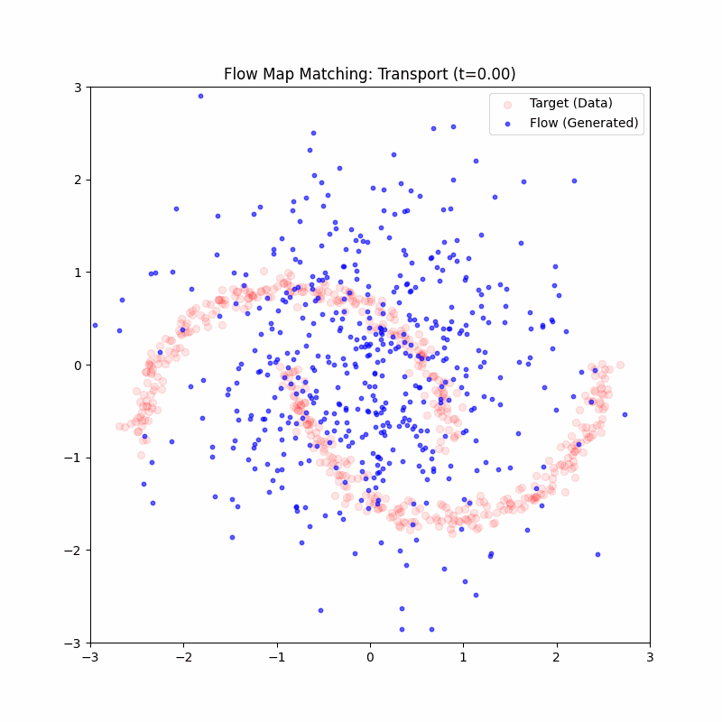
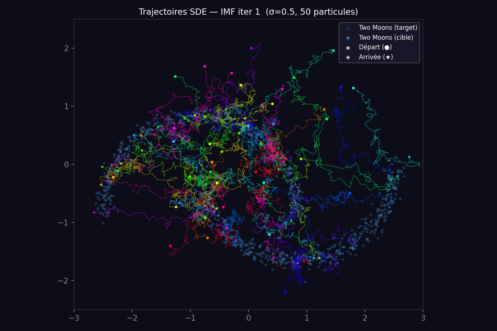
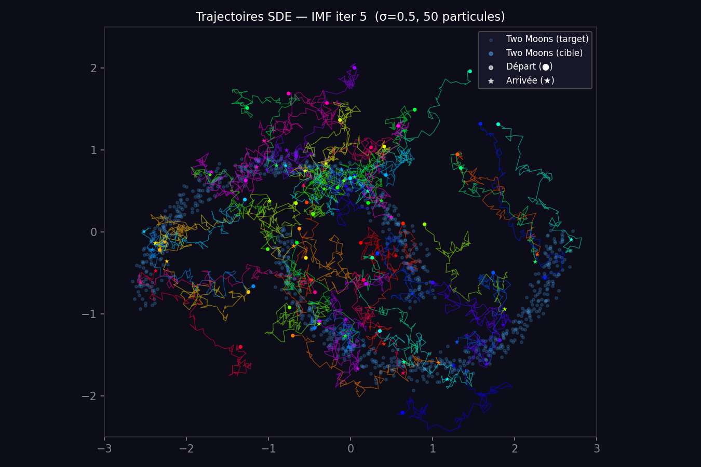
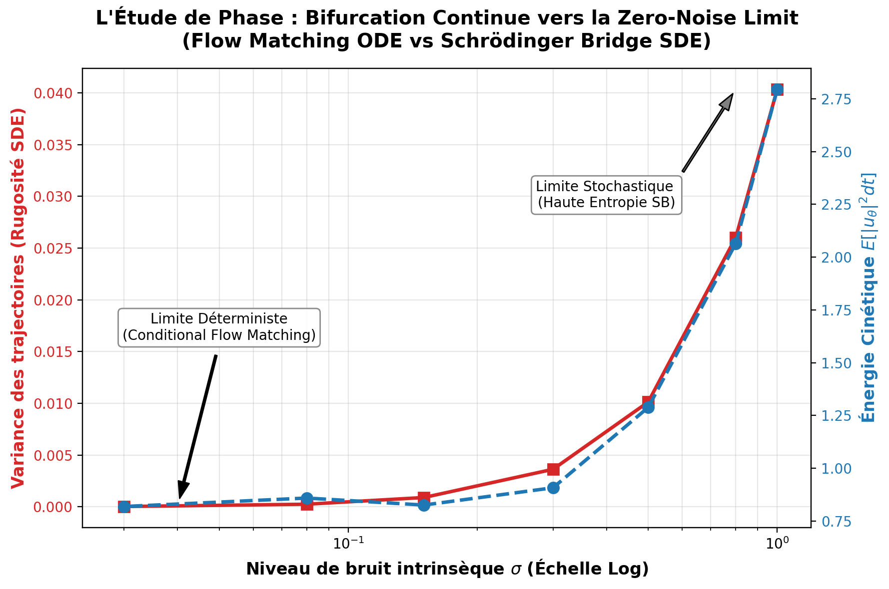

<p align="center">
  <h1 align="center"> Flow Matching, LMD & Schrödinger Bridges</h1>
  <p align="center">
    <em>Unifying Conditional Flow Matching, Lagrangian Map Distillation and Diffusion Schrödinger Bridge Matching (DSBM)</em>
  </p>
  <p align="center">
    
    
    
  </p>
</p>

---

## Introduction & Motivation

Generative modeling via continuous-time processes like Diffusion Models or **Conditional Flow Matching (CFM)** has shown spectacular success. However, generating a single sample requires solving an Ordinary (ODE) or Stochastic (SDE) Differential Equation numerically over dozens or hundreds of integration steps. This makes **inference prohibitively slow and computationally expensive**.

This project implements and compares three state-of-the-art approaches to generative transport on a 2D two-moons benchmark:

1. **Conditional Flow Matching (CFM)** — A deterministic ODE framework that transports noise to data smoothly over time.
2. **Diffusion Schrödinger Bridge Matching (DSBM)** — A stochastic SDE framework that learns the entropy-regularized optimal transport via Iterative Markovian Fitting, finding the most efficient stochastic path between two distributions.
3. **Lagrangian Map Distillation (LMD)** — Also known mathematically as Lagrangian Flow Map Matching (L-FMM). The ultimate solution to the inference cost problem. LMD "distills" the slow, multi-step transport map of a trained CFM model into a **One-Step Student Network**. It completely bypasses the ODE/SDE solver, yielding an inference speedup of two orders of magnitude while preserving generation quality.

---

## Visual Showcase

### 1. Distilled One-Step Generation (LMD)
The Flow Map *(Student)* learned to transport Gaussian noise $x_0 \sim \mathcal{N}(0, I)$ to the target two-moons distribution in a **single forward pass**. The teacher was trained on a linear interpolant (Rectified Flow).

<p align="center">
  
</p>

### 2. Stochastic Transport via Schrödinger Bridges (DSBM)
Instead of straight deterministic paths, the DSBM algorithm learns a highly structured **stochastic flow** (SDE). Over the course of Iterative Markovian Fitting (IMF), the chaotic initial paths are refined into organized streams targeting the two moons.

***Left:** Iteration 1 (chaotic independent coupling) — **Right:** Iteration 5 (refined Schrödinger Bridge)*
<p align="center">
  
  
</p>

---

##  Methodology & Algorithms

### 1. Conditional Flow Matching (Teacher)
The Teacher network `VelocityField` $v_\theta(x_t, t)$ learns the instantaneous continuous normalising flow.
- We define an interpolant between $x_0$ (noise) and $x_1$ (data): $x_t = \alpha_t x_0 + \beta_t x_1 + \gamma_t z$.
- The teacher minimizes the regression loss against the target conditional vector field $u_t(x∣x_0,x_1)$.
- **Inference:** Requires solving the ODE $\frac{dx}{dt} = v_\theta(x, t)$ over $N$ steps (e.g., $N=100$).

### 2. Lagrangian Map Distillation (Student)
The Student network `FlowMapNetwork` $X_\varphi(x, s, t)$ directly learns the macroscopic transport map.
- Instead of velocity, it predicts the final destination.
- Hard constraint formulation: $X_\varphi(x, s, t) = x + (t - s)\bar{v}_\varphi(x, s, t)$, naturally satisfying $X(x,s,s)=x$.
- Training requires the student's temporal derivative to match the frozen teacher's vector field along the flow.
- **Inference:** **1 step**! Evaluation at $t=1$ yields $x_1 = X_\varphi(x_0, 0, 1)$.

### 3. Diffusion Schrödinger Bridge Matching (DSBM)
For settings where we want minimum-entropy stochatic transport from $P_0$ to $P_1$ without knowing the joint coupling.
- The reference process is a Brownian Bridge $x_t$ with noise scale $\sigma$.
- We use **Iterative Markovian Fitting (IMF)**:
  1. Draw pairs $(x_0, x_1)$ from current coupling $\pi_k$.
  2. Minimize `BridgeMatchingLoss` to learn SDE drift $u_\theta(x_t, t)$.
  3. Form new coupling $\pi_{k+1}$ by pushing $x_0$ through the learned SDE.
- Converges to the Schrödinger Bridge.
- **Inference:** Requires solving the SDE $dx_t = u_\theta dt + \sigma dW_t$ via Euler-Maruyama over $N$ steps.

---

##  Quantitative Results

All the rigorous experimental results backing our implementations are located in our metrics logs. 

### 1. Inference Cost — The Genius of LMD
The entire motivation for this project is visible here. Generating 10,000 samples on a standard CPU:

| Algorithm (Model) | Resolution Method | Generative Time | Speedup vs Teacher |
|---|---|---|---|
| **DSBM** (`DriftNetwork`) | SDE (Euler-Maruyama, 100 steps) | ~2.17 s | Baseline |
| **CFM** (`VelocityField`) | ODE (Euler, 100 steps) | ~0.91 s | Baseline |
| **LMD** (`FlowMapNetwork`)| **Single Forward Pass** (1 step) | **~0.018 s** | **~48x to 115x Faster** |

By mathematically distilling the integration process into the network weights, LMD solves the fundamental deployment bottleneck of flow-based and diffusion models.

### 2. DSBM Metrics over IMF Iterations
As the Iterative Markovian Fitting loop progresses, the SDE transport map dramatically improves, shrinking the cost of transport toward the theoretical optimum.

| IMF Iteration | Wasserstein-2 (W₂) | MMD (Mode collapse check) | Kinetic Energy (Cost) |
|:---:|:---:|:---:|:---:|
| **1** *(Independent Coupling)* | 0.270 | 0.034 | 2.06 |
| **3** | 0.185 | 0.028 | 1.21 |
| **5** *(Schrödinger Bridge)*| **0.178** | **0.040** | **1.17** |

*W₂ distance improves by roughly 35%, and the empirical Kinetic Energy drops by almost 50%, validating the entropy-regularized Optimal Transport convergence of the DSBM algorithm implementation.*

### 3. Phase Study: The Continuous Bifurcation ($\sigma \to 0$)
Theoretically, the Zero-Noise Limit of a Diffusion Schrödinger Bridge matches the deterministic Optimal Transport map of Conditional Flow Matching. We validated this phenomenon by sweeping the intrinsic SDE noise parameter $\sigma$ from $1.0$ down to $0.03$.

<p align="center">
  
</p>

*As $\sigma$ decreases, the **Trajectory Variance** (the Brownian "tremor", in red) asymptotes to absolute zero. The highly stochastic paths structurally freeze into straight, deterministic ODE lines. Concurrently, the **Kinetic Energy** (in blue) drops and stabilizes at the minimal physical cost corresponding to the Monge-Kantorovich optimal transport.*

## Usage & Repository Structure

### Installation
```bash
git clone https://github.com/<your-username>/flow_matching_sde.git
cd flow_matching_sde
python -m venv venv && source venv/bin/activate
pip install -r requirements.txt
```

### Running the Scripts
| Command | Description |
|---|---|
| `python -m src.neural_nets.training` | Train the Teacher (Velocity Field) via CFM |
| `python -m src.neural_nets.training_fm` | Train the Student (Flow Map) via LMD |
| `python -m src.neural_nets.training_dsb` | Train the SDE Drift via DSBM (Iterative Markovian Fitting) |
| `python -m src.experiments.experiment_inference_cost` | Run the throughput benchmark |

*A complete mathematical derivation of all algorithms implemented in this base is available in the [`reports/flow_matching_sde_report.pdf`](reports/flow_matching_sde_report.pdf).*

---

## 📖 References

- Lipman, Y., Chen, R. T., Ben-Hamu, H., Nickel, M. (2023). *Flow Matching for Generative Modeling*. ICLR 2023.
- Albergo, M. S., Vanden-Eijnden, E. (2023). *Building Normalizing Flows with Stochastic Interpolants*. ICLR 2023.
- Shi, Y., De Bortoli, V., Campbell, A., Doucet, A. (2023). *Diffusion Schrödinger Bridge Matching*. NeurIPS 2023.
- Liu, X., Gong, C., Liu, Q. (2023). *Flow Straight and Fast: Learning to Generate and Transfer Data with Rectified Flows*. ICLR 2023.
- Boffi, N. M., Albergo, M. S., & Vanden-Eijnden, E. (2024/2025). *Flow map matching with stochastic interpolants*.
- Uscidda, T., & Cuturi, M. (2023). *The Monge Gap: A Regularizer to Learn All Transport Maps*.